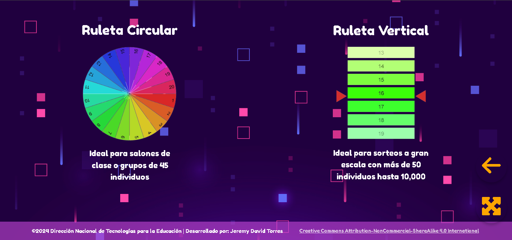
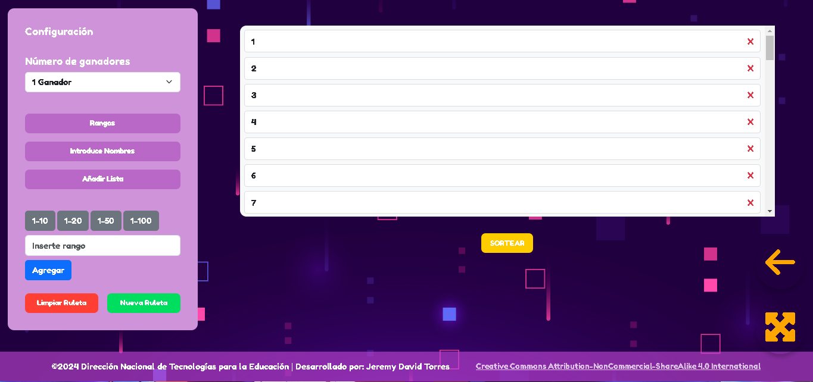
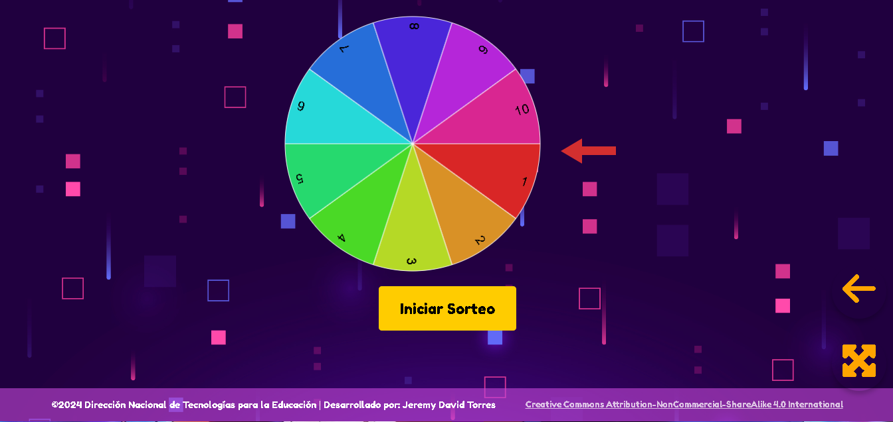
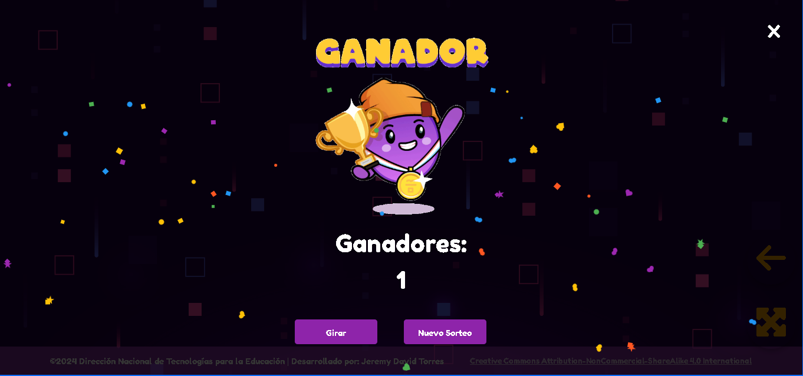

# 🎉 Ruleta Aleatoria 🎉

¡Bienvenido al proyecto **Ruleta Aleatoria**! 🎰 Este proyecto tiene como objetivo ofrecer una herramienta divertida y dinámica para realizar sorteos de manera aleatoria. Es ideal para **sorteos educativos**, **juegos de azar** o para realizar actividades con grupos grandes de personas.

## 📦 Descripción del Proyecto

La **Ruleta Aleatoria** es una aplicación web interactiva que permite realizar sorteos de manera visual y dinámica. Utiliza diferentes tipos de ruletas, como la **ruleta circular** y la **ruleta vertical**, con la capacidad de personalizar los participantes y el número de ganadores.

Con este proyecto podrás:

- Configurar y personalizar las ruletas con diferentes números de participantes.
- Iniciar sorteos de manera sencilla con animaciones.
- Visualizar el resultado del sorteo con un efecto visual llamativo.
- Obtener resultados aleatorios para cualquier tipo de evento.

🎯 **Usos**:
- Sorteos educativos.
- Juegos de azar.
- Actividades grupales.
- Y mucho más...

## 📸 Imágenes y GIFs

Aquí hay algunas capturas de pantalla mostrando cómo funciona la ruleta:

*Página de inicio para elegir el tipo de ruleta.*


*Configuración del sorteo.*


*Ruleta circular.*


*Ruleta vertical.*


*Pantalla de Ganadores.*



## 🚀 Características

- **Interfaz de usuario limpia y amigable**: Asegura que el usuario pueda interactuar sin complicaciones.
- **Compatibilidad con dispositivos móviles y escritorios**: Adaptabilidad a pantallas grandes y pequeñas.
- **Configuraciones personalizables**: Puedes ajustar el número de ganadores, participantes y más.
- **Efectos visuales**: Animaciones y transiciones suaves para una experiencia más inmersiva.

## 🌐 Aplicación en Vivo

La aplicación está desplegada y lista para su uso. Puedes acceder a ella en el siguiente enlace:

👉 [Ruleta Aleatoria - Aplicación en Vivo](https://recursos.educacion.gob.ec/red/ruleta-aleatoria/)

## 🛠 Tecnologías Usadas

- **HTML**: Estructura básica de la página.
- **CSS**: Estilos y animaciones para la interfaz.
- **JavaScript**: Lógica para controlar las animaciones y la funcionalidad de la ruleta.


## 📥 Instalación

Si deseas ejecutar el proyecto localmente en tu computadora, sigue los siguientes pasos:

1. Clona este repositorio en tu máquina local:

   ```bash
   git clone https://github.com/SrKarma07/ruleta-aleatoria.git

2. Abre el archivo index.html en tu navegador favorito.


¡Eso es todo! Ahora podrás disfrutar de la Ruleta Aleatoria localmente.
## 🤖 Contribuciones

Si tienes ideas para mejorar este proyecto o quieres contribuir, siéntete libre de abrir un **pull request** o **issue**. ¡Estamos felices de recibir contribuciones de la comunidad!

## 🧑‍💻 Autores

- **Jeremy David Torres** - [Perfil de GitHub](https://github.com/SrKarma07)
- **Colaboradores** - ¡Gracias a todos los que contribuyen al proyecto!

## 📄 Licencia

Este proyecto está bajo uso de **Licencias** - consulta el archivo [LICENSE](https://creativecommons.org/licenses/by-nc-sa/4.0/?ref=chooser-v1) para más detalles.

---

¡Gracias por usar **Ruleta Aleatoria**! 🎉 Que la suerte esté siempre de tu lado. 🍀
